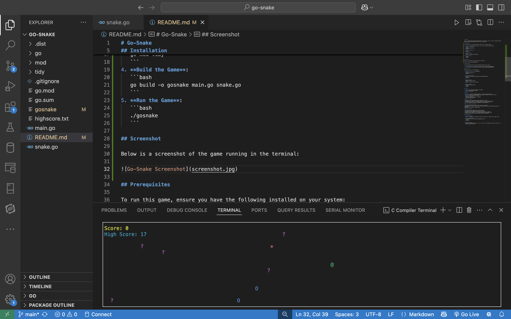

# Go-Snake

This is a terminal-based Snake game implemented in Go using the `termbox-go` library. The game includes numerous features like obstacles, portals, and a scoring system.

## Installation

If you are new to Go, follow these steps to install and run the game quickly:

1. **Install Go**: Download and install Go from [golang.org](https://golang.org/dl/).
2. **Clone the Repository**:
   ```bash
   git clone <repository-url>
   cd gosnake
   ```
3. **Install Dependencies**:
   ```bash
   go mod tidy
   ```
4. **Build the Game**:
   ```bash
   go build -o gosnake main.go snake.go
   ```
5. **Run the Game**:
   ```bash
   ./gosnake
   ```

## Screenshot

Below is a screenshot of the game running in the terminal:



## Prerequisites

To run this game, ensure you have the following installed on your system:

1. **Go Programming Language**: Install Go from [golang.org](https://golang.org/dl/).
2. **Git**: Ensure Git is installed to clone the repository and manage dependencies.

## How to Run

Follow these steps to run the Snake game:

1. **Clone the Repository** (if applicable):
   ```bash
   git clone <repository-url>
   cd gosnake
   ```

2. **Install Dependencies**:
   Run the following command to download the required dependencies:
   ```bash
   go mod tidy
   ```

3. **Build the Game**:
   Compile the game by running:
   ```bash
   go build -o gosnake main.go snake.go
   ```

4. **Run the Game**:
   Execute the compiled binary:
   ```bash
   ./gosnake
   ```

## Controls

- **Arrow Keys**: Control the direction of the snake.
- **Space**: Pause or resume the game.
- **ESC**: Exit the game.

## Features

- **Obstacles**: Randomly generated obstacles (`?`) that the snake must avoid.
- **Portals**: Entry (`O`) and exit points that teleport the snake to a different location.
- **Scoring**: Earn points by eating food (`*`).
- **Game Over Conditions**:
  - Collision with walls, itself, or obstacles.
  - Exiting the game manually.

## High Score Feature

- The game now tracks the highest score achieved across sessions.
- The high score is saved to a file named `highscore.txt` in the project directory.
- Each time the game starts, it loads the previous high score from this file.
- If a new high score is achieved, it updates the file automatically.

## Dynamic Leveling and Obstacles

- The game dynamically increases the level as the score increases.
- New obstacles are added to the game board with each level-up, making the game progressively more challenging.
- The level increases every 2 points scored.

## How the Game Works

- The snake moves continuously in the current direction.
- Use the arrow keys to change the direction of the snake.
- The game ends if the snake collides with the walls, itself, or obstacles.
- The goal is to eat the food (`*`) to grow the snake and increase your score.
- Portals allow the snake to teleport between two points on the board.

## Troubleshooting

1. **Go Not Installed**:
   If the `go` command is not recognized, install Go and ensure it is added to your system's PATH.

2. **Missing Dependencies**:
   If you encounter errors about missing dependencies, run:
   ```bash
   go mod tidy
   ```

3. **Terminal Issues**:
   Ensure your terminal supports the `termbox-go` library. If the game does not render correctly, try a different terminal emulator.
